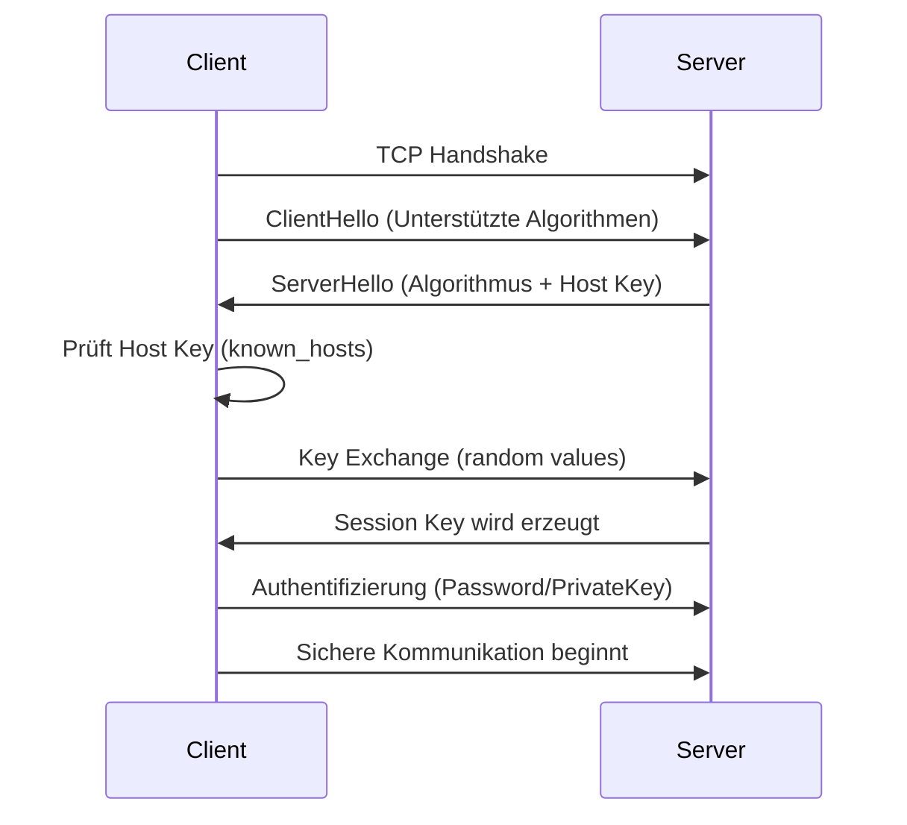

# 🔐 SSH -- Grundlagen, Funktionsweise & Sicherheit

## 📘 1. Was ist SSH?

SSH (*Secure Shell*) ist ein Netzwerkprotokoll, das eine
**verschlüsselte**, **authentifizierte** und **integritätsgeschützte**
Kommunikation zwischen einem Client (Laptop/PC) und einem Server
ermöglicht.

👉 SSH ersetzt unsichere Protokolle wie **Telnet** oder **FTP**, die
Passwörter im Klartext übertragen.

---

## 🎯 2. Einsatzgebiete von SSH

  | Einsatzgebiet | Beschreibung |
  |---------------|--------------|
  | 🖥️ Remote-Login | Zugriff auf Linux-Server über Terminal |
  | 📂 SFTP | Sichere Dateiübertragung über SSH | 
  | 🔄 Git over SSH | Push/Pull ohne Passworteingabe | 
  | 🐳 Serververwaltung | Deployment, Docker, Nginx, Systemdienste | 
  | 🤖 Automatisierung | CI/CD-Pipelines, Cronjobs, Skripte | 

---

## 🔑 3. Authentifizierung: Passwort vs. Schlüsselpaare

SSH unterstützt zwei Methoden:

### **a) Passwort-Authentifizierung**

-   Einloggen mit Benutzername + Passwort\
-   Weniger sicher, anfällig für Brute-Force-Attacken

### **b) Key-basierte Authentifizierung (empfohlen)**

Ein Schlüsselpaar besteht aus:

| Datei | Zweck |
|------|--------|
| **Private Key** (`id_ed25519`) | Geheime Identität, bleibt lokal |
| **Public Key** (`id_ed25519.pub`) | Wird auf dem Server gespeichert |

🔐 **Der Server prüft, ob der Client den passenden privaten Schlüssel
besitzt.**

---

## 🧠 4. Wie funktioniert SSH im Hintergrund?

SSH nutzt eine Kombination aus:

-   **Asymmetrischer Kryptographie** (für Identitätsprüfung)
-   **Diffie-Hellman Key Exchange** (für Session Key)
-   **Symmetrischer Verschlüsselung** (für Datenübertragung)

### 🔁 **Vereinfacht dargestellter Ablauf:**



---

## 🔐 5. Host Keys & known_hosts

Beim ersten Verbindungsaufbau erscheint:

    The authenticity of host 'server' can't be established.
    Are you sure you want to continue connecting?

👉 Hier identifiziert sich der *Server* mit seinem **Host Key**.

Der Key wird unter Linux gespeichert in:

    ~/.ssh/known_hosts

Wenn sich ein Server ändert (z. B. neu installiert), erhält man:

    Host key verification failed

Lösung:

    nano ~/.ssh/known_hosts

Eintrag löschen → erneut verbinden.

---

## 🛠️ 6. SSH-Schlüssel generieren

Am besten verwendet man **ED25519** (schnell & sicher):

``` bash
ssh-keygen -t ed25519 -C "mein-key"
```

Das erzeugt:

-   `~/.ssh/id_ed25519`
-   `~/.ssh/id_ed25519.pub`

### Public Key auf den Server kopieren:

``` bash
ssh-copy-id benutzer@server-ip
```

oder manuell in:

    ~/.ssh/authorized_keys

---

## 🧩 7. Mehrere SSH-Keys verwalten

Für GitHub, private Server, Hosting-Anbieter etc.:

    ~/.ssh/config

Beispiel:

    Host github.com
        IdentityFile ~/.ssh/id_ed25519_github

    Host vps
        HostName 00.66.000.111
        User root
        IdentityFile ~/.ssh/id_ed25519_vps

Danach reicht:

    ssh vps

---

## 🌐 8. SSH vs FTP vs SFTP

  | Protokoll | Verschlüsselt? | Beschreibung | 
  |-----------|----------------| -------------| 
  | **FTP** | ❌ | Veraltet, unsicher | 
  | **FTPS** | ✔ | FTP über TLS | 
  | **SFTP** | ✔ | Dateiübertragung über SSH | 
  | **SSH** | ✔ |  Vollständiger sicherer Remote-Zugang | 

---

## 🏢 9. Shared Hosting (z.B. clientcp) vs VPS (Virtual Private Server) --- SSH Unterschiede

  | Merkmal | Shared Hosting | VPS | 
  |---------|----------------|-----| 
  | Rechte | begrenzt, kein root | vollständiger root | 
  | Ports | nur 22 | frei konfigurierbar | 
  | Software installieren | ❌ | ✔ Docker, Nginx, UFW, etc. | 
  | Dateisystem | nur public_html | vollständige Kontrolle | 
  | Isolation | Benutzer-Level | eigene virtuelle Maschine | 

**Shared Hosting benutzt chroot/CageFS → kein echter Systemzugang.**

---

## 🧪 10. Wichtige SSH-Befehle

### Verbinden

``` bash
ssh user@server
ssh -i ~/.ssh/meinkey user@server
```

### Dateien kopieren

``` bash
scp datei.txt user@server:/path/
scp -r ordner/ user@server:/path/
```

### Public Key kopieren

``` bash
ssh-copy-id user@server
```

### Aktive SSH-Verbindungen anzeigen

``` bash
sudo ss -tanp | grep ESTABLISHED
```

---

## 🐞 11. Häufige Fehler & Lösungen

### ❌ `Connection timed out`

-   Firewall blockiert Port 22
-   Server offline
-   SSH-Dienst läuft nicht

### ❌ `Permission denied (publickey)`

-   Falscher Key
-   Public Key fehlt auf Server
-   Rechte falsch (`~/.ssh` muss 700 sein)

### ❌ `Host key verification failed`

→ Host-Key in `known_hosts` löschen

---

## 📌 12. Zusammenfassung

SSH ist die Grundlage für:

-   Serveradministration
-   Webhosting
-   DevOps / Deployment
-   Git-Automation
-   Sichere Dateitransfers

Mit SSH-Keys, Host Keys und Session Encryption bietet SSH ein sehr hohes
Sicherheitsniveau, das in nahezu allen modernen IT-Infrastrukturen
verwendet wird.

---

*Ende des Dokuments*
